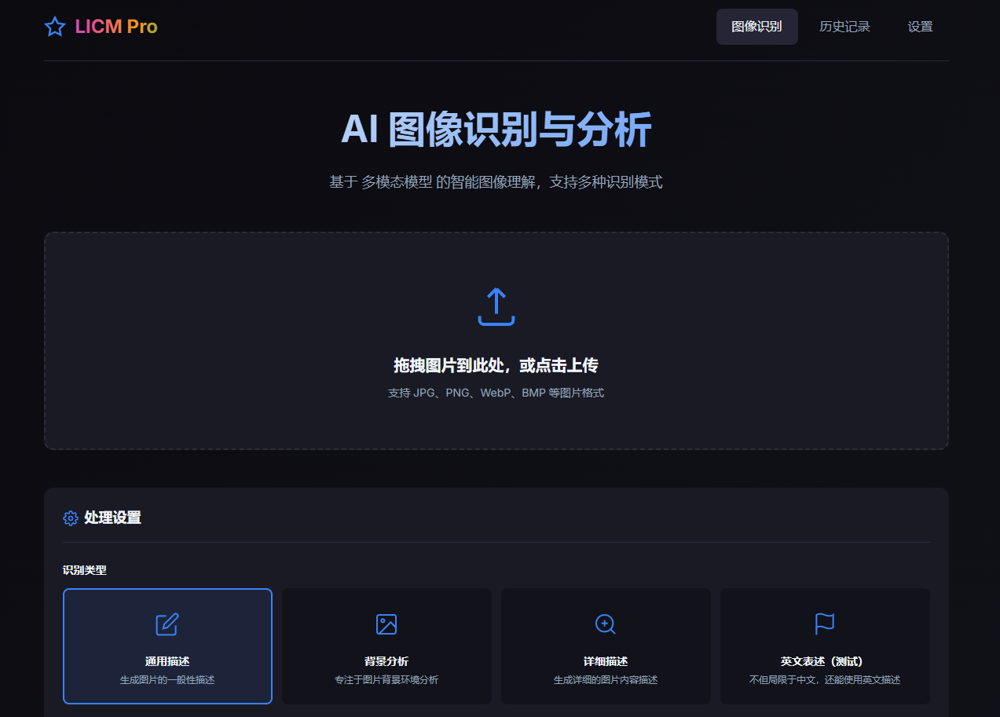

# LICM

轻量化图像描述模型本地部署系统 (Lightweight Image Captioning Model)



## 项目简介

LICM 是一个基于 VGLM 的轻量化图像描述模型本地部署系统，提供 Web 界面用于图像识别与分析。支持多种识别模式，包括通用描述、背景分析、详细描述等。用户可自己部署本地模型或者使用模型API来增加模型的选择。

## 功能特性

- **图像识别**：支持 JPG、PNG、WebP、BMP 等多种图片格式
- **多种识别模式**：
  - 通用描述：生成图片的一般性描述
  - 背景分析：专注于图片背景环境分析
  - 详细描述：详细描述图片的所有内容
  - 英文描述：使用英文描述图片
- **Web 界面**：简洁美观的 Web UI，支持拖拽上传
- **量化加速**：支持 4-bit 量化，降低显存占用
- **本地部署**：数据隐私安全，无需联网即可使用

## 项目结构

```
LICM/
├── app.py                  # Flask 主应用入口
├── requirements.txt        # Python 依赖
├── README.md              # 项目说明文档
├── static/                # 静态资源
│   ├── css/
│   │   └── style.css      # 样式文件
│   └── js/
│       └── app.js         # 前端脚本
├── templates/             # HTML 模板
│   └── index.html         # 主页面
└── visualglm/             # VisualGLM 模型文件
    ├── config.json
    ├── pytorch_model-*.bin
    └── ...
```

## 环境要求

- Python >= 3.8
- CUDA >= 11.7 (推荐，用于 GPU 加速)
- 显存 >= 6GB (使用 4-bit 量化)
- 内存 >= 16GB

## 安装部署

### 1. 克隆仓库

```bash
git clone <repository-url>
cd LICM
```

### 2. 安装依赖

```bash
pip install -r requirements.txt
```

### 3. 准备模型

这里拿VisualGLM-6B模型为例。其他如千问3等此类模型也可以使用本项目部署，方法一样。
我这里已经下好了除模型参数文件外的其他文件，项目默认使用本地 `./visualglm` 目录加载模型。如果该目录不存在，将自动从 HuggingFace 下载 `THUDM/visualglm-6b` 模型。

或者手动下载模型：

完整的模型实现可以在 [Hugging Face Hub](https://huggingface.co/THUDM/visualglm-6b)。如果你从 Hugging Face Hub 上下载模型参数的速度较慢，可以从[这里](https://cloud.tsinghua.edu.cn/d/43ffb021ca5f4897b56a/)手动下载模型参数文件，并从本地加载模型。

#### 预训练模型

本项目作者使用 MSCOCO 训练集对 VisualGLM-6B 进行了微调训练，得到了适用于图像中英文描述任务的优化模型：

- **mscocoEN30000** - 基于 MSCOCO 数据集微调的 VisualGLM-6B 模型
  - 阿里云盘下载：[下载地址](https://www.alipan.com/s/jyg74yaY9WX) (提取码: 3fp9)
  - 相关训练代码和详细说明可参考：[VGLM 微调项目](https://github.com/ROCchender/VGLM)

该微调版本在图像描述任务上有更好的表现，为 SAT 框架加载使用。

```bash
# 从 HuggingFace 下载
huggingface-cli download THUDM/visualglm-6b --local-dir ./visualglm
```

### 4. 启动服务

```bash
# 使用 Flask 启动
python app.py

服务启动后，访问 http://localhost:5000 即可使用。

## 使用说明

1. 打开浏览器访问 Web 界面
2. 拖拽或点击上传图片
3. 选择识别类型（通用描述/背景分析/详细描述/英文描述）
4. 点击识别按钮，等待结果

## API 接口

### 图像识别接口

**URL**: `/generate`

**Method**: `POST`

**Content-Type**: `multipart/form-data`

**参数**:
| 参数名 | 类型 | 必填 | 说明 |
|--------|------|------|------|
| image | File | 是 | 图片文件 |
| type | String | 否 | 识别类型 (general/background/detailed/english)，默认 general |

**返回示例**:
```json
{
  "success": true,
  "caption": "图片中包含一只猫在草地上玩耍..."
}
```

## 技术栈

- **后端**: Flask, Flask-CORS
- **深度学习**: PyTorch, Transformers
- **量化**: BitsAndBytes, Accelerate
- **前端**: HTML5, CSS3, JavaScript


## 许可证

VisualGLM-6B 模型项目采用 [Apache-2.0](LICENSE) 许可证。

模型权重遵循 VisualGLM-6B 的 [MODEL_LICENSE](visualglm/MODEL_LICENSE)。

## 致谢

- [VisualGLM-6B](https://github.com/THUDM/VisualGLM-6B) - 清华大学开源的多模态大模型
- [HuggingFace Transformers](https://huggingface.co/docs/transformers) - 深度学习模型库
- [Flask](https://flask.palletsprojects.com/) - Web 框架

## 联系方式

如有问题或建议，欢迎提交 Issue 或 Pull Request。
